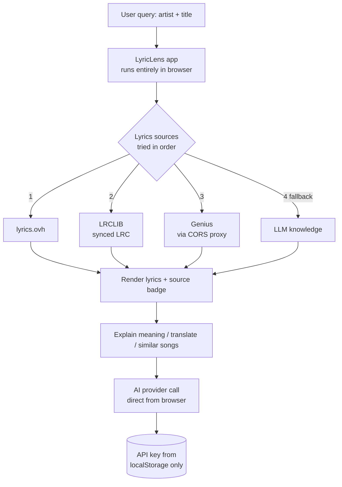

# LyricLens

**Client-side AI song-meaning + multi-source lyrics web app.** Search lyrics across lyrics.ovh, LRCLIB, and Genius (with an LLM knowledge fallback), then get a one-click AI explanation of what a song actually means — theme, verse-by-verse breakdown, mood, and cultural references. 100% client-side: your API keys never leave your browser.

[](https://github.com/chirag127/LyricLens-AI-Song-Meaning-Web-App/stargazers)
[](LICENSE)
[](https://github.com/chirag127/LyricLens-AI-Song-Meaning-Web-App/commits)
[](https://developer.mozilla.org/docs/Web/JavaScript)

## What it is / why it exists

Lyrics sites are ad-heavy and rarely explain anything; AI chat tools explain well but make you paste lyrics yourself. LyricLens does both in one place — it pulls lyrics from several free sources, shows which one delivered, and layers an AI meaning/analysis on top. It runs entirely in the browser with no backend, so it costs nothing to host and never sees your data or keys.

## Links

- **Live site:** https://lyriclens.oriz.in
- **Repo:** https://github.com/chirag127/LyricLens-AI-Song-Meaning-Web-App
- **GitHub Pages:** the Cloudflare domain (lyriclens.oriz.in) is the canonical live site; GitHub Pages (https://chirag127.github.io/LyricLens-AI-Song-Meaning-Web-App/) serves the repo landing/about page.

## ⭐ Star this repo

If this is useful, please ⭐ star the repo — it helps others find it.

## How it works



## Features

- **Multi-source lyrics** — queries lyrics.ovh, LRCLIB, Genius (via CORS proxy), then LLM knowledge as fallback; shows which source delivered the result
- **Synced lyrics** — if LRCLIB returns an LRC file, lyrics highlight line-by-line
- **Explain meaning** — one click: overall theme, verse-by-verse breakdown, mood/sentiment badge, cultural references, allusions
- **Web analysis** — automates fan/critic interpretation lookup; summarizes via LLM; falls back to Google search if blocked
- **Similar songs** — LLM suggests 4 related songs; click any to search instantly
- **Language detection** — auto-detects lyrics language; badge in UI
- **Translate lyrics** — translate to any language via LLM (prompt for target language)
- **Autocomplete** — Genius-powered song/artist suggestions as you type
- **Recent searches** — last 20 searches stored in localStorage
- **Favorites** — save/unsave songs; persisted in localStorage
- **Share link** — URL params `?artist=&title=` for direct deep links; copy link button
- **Copy lyrics** — one-click clipboard copy
- **Dark/light theme** — toggle + persisted preference
- **Settings panel** — pick AI provider + API key (stored locally only) + optional Genius token
- **Keyboard shortcuts** — `Ctrl+K` focuses search; `Esc` closes panels
- **Loading skeletons** + graceful error toasts
- **Responsive** — mobile-first design

## AI providers

| Provider | Free? | Key required |
|---|---|---|
| **Pollinations** | Yes (default) | No |
| Groq | Free tier | Yes |
| Cerebras | Free tier | Yes |
| Google Gemini | Free tier | Yes |
| OpenRouter | Free models | Yes |
| Mistral | Free tier | Yes |
| Custom OpenAI-compat | — | Optional |

Configure in Settings (gear icon). Keys stored in `localStorage` only.

## Tech stack

| Layer | Technology |
|---|---|
| Frontend | Vanilla HTML / CSS / JavaScript (no framework, no build step) |
| Lyrics sources | lyrics.ovh, LRCLIB, Genius (via `corsproxy.io`) |
| AI | Client-side calls to Pollinations / Groq / Cerebras / Gemini / OpenRouter / Mistral / custom OpenAI-compatible endpoints |
| Storage | Browser `localStorage` (settings, keys, favorites, recent searches) |
| Hosting | Static files on Cloudflare (custom domain) + GitHub Pages |
| Data tooling (optional) | Python scrapers in `scripts/` (legacy, standalone) |

## Repository structure

```
lyriclens/
├── docs/                  # the deployed static app (GitHub Pages / Cloudflare source)
│   ├── index.html
│   ├── CNAME              # lyriclens.oriz.in
│   ├── css/styles.css
│   └── js/
│       ├── app.js            # UI wiring, state, search flow
│       ├── lyrics-sources.js # lyrics.ovh / LRCLIB / Genius / LLM fallback
│       ├── ai-providers.js   # provider registry + client-side LLM calls
│       ├── meaning.js        # explain / translate / similar-songs prompts
│       └── ui.js             # rendering, toasts, theme, shortcuts
├── scripts/               # optional legacy Python data-generation scrapers
├── requirements.txt       # legacy scaffolding for scripts/ only
└── LICENSE
```

## Quick start

The app is fully static — just serve `docs/`:

```bash
git clone https://github.com/chirag127/LyricLens-AI-Song-Meaning-Web-App.git
cd LyricLens-AI-Song-Meaning-Web-App/docs
python -m http.server 8000
# open http://localhost:8000
```

Then open Settings (gear icon), pick an AI provider (Pollinations works with no key), and search. Or just use the hosted app at [lyriclens.oriz.in](https://lyriclens.oriz.in).

## Configuration (client-side only)

There is no server and no server-side environment. All configuration lives in the browser Settings panel and is persisted in `localStorage` on your device — nothing is ever transmitted to a backend.

| Setting | Purpose |
|---|---|
| AI provider | Which LLM the app calls (Pollinations default, no key) |
| API key | Key for the selected provider — stored in `localStorage` only, sent directly to the provider from your browser |
| Genius token | Optional Genius client token for better lyrics/autocomplete results — stored in `localStorage` only |
| Theme | Dark / light preference |

Clear the site's browser data to remove all stored keys and preferences.

## How multi-source lyrics works

1. **lyrics.ovh** — free, no key, CORS-ok
2. **LRCLIB** — free, no key, returns synced (LRC) + plain lyrics
3. **Genius** — public search + page scrape via `corsproxy.io`; add a Genius client token in Settings for better results
4. **LLM knowledge fallback** — if all sources fail, asks the selected AI for lyrics from its training data (labeled "AI knowledge")

## Privacy

- Zero backend. No server receives your queries or keys.
- API keys stored in browser `localStorage`. Clear site data to remove.
- Lyrics fetched directly from public APIs from your browser.

## Dataset

The original scraped lyrics dataset (CSV + per-song txt files, ~24 MB) was moved out of the repo to keep it lean. [Download it from GitHub Releases](https://github.com/chirag127/LyricLens-AI-Song-Meaning-Web-App/releases/tag/dataset-v1).

## Scripts (optional data tooling)

`scripts/` contains the original Python scrapers, cleaned up and env-var'd:

```bash
GENIUS_TOKEN=your_token ARTIST="Taylor Swift" python scripts/genius_api.py
OPENAI_API_KEY=sk-... SONG="Bohemian Rhapsody" ARTIST="Queen" python scripts/cgpt.py
```

These are standalone data-generation tools, not part of the web app.

## $0 hosting

LyricLens runs entirely in the browser against public APIs, so it hosts for **$0 on Cloudflare's free tier** — no server, no database, no bill.

## Part of the oriz family

LyricLens is one of ~80 sites and tools in the **oriz** family. See the rest at [blog.oriz.in](https://blog.oriz.in).

## Contributing

Issues and PRs welcome. Conventional commits are the changelog.

## License

MIT © Chirag Singhal

## Author

**Chirag Singhal** — [chirag@oriz.in](mailto:chirag@oriz.in)

## Status & roadmap

Live and stable. Future ideas: more lyrics sources, offline caching of explanations, and shareable meaning cards.
